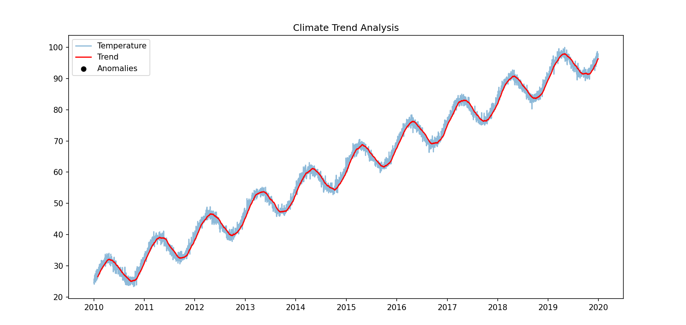
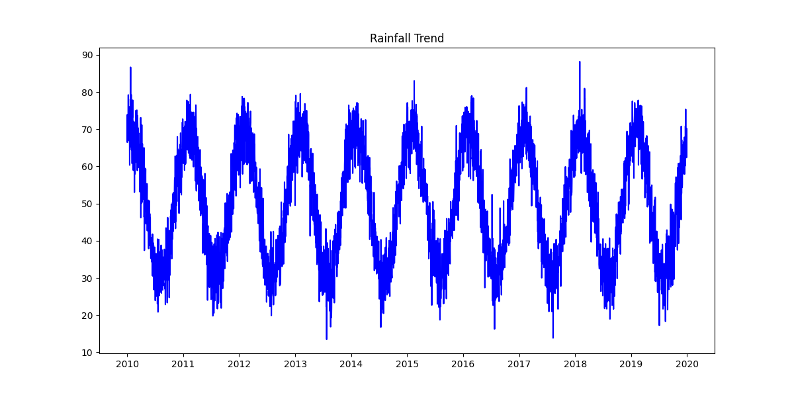
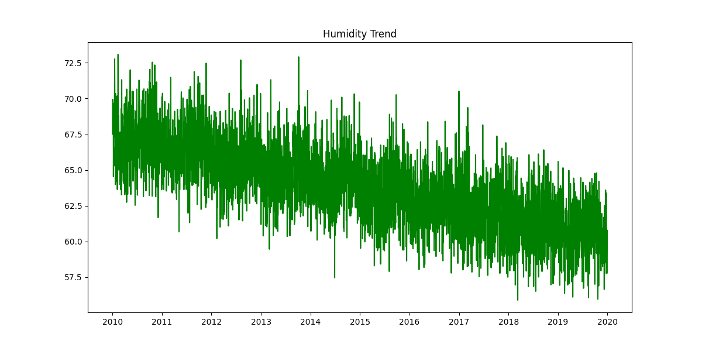
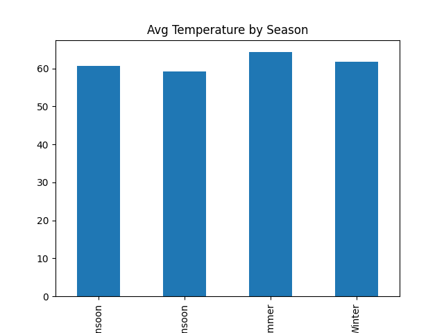
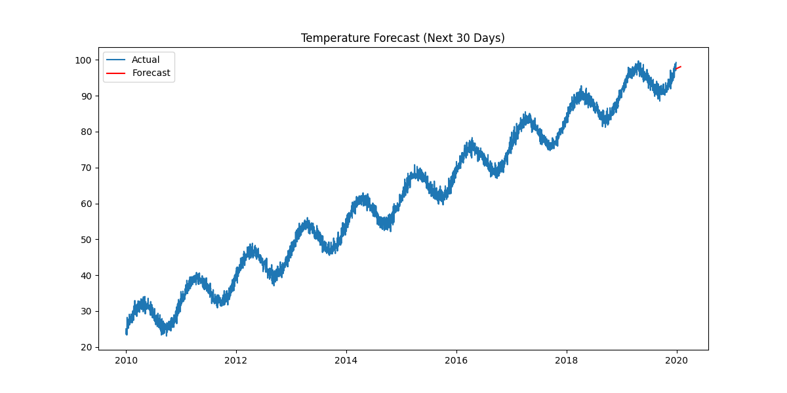

# 🌍 Climate Trend Analyzer

An end-to-end data science project that analyzes long-term climate patterns and predicts future temperature trends using machine learning.

---
## 📌 Project Overview

This project simulates and analyzes climate data over 10 years, focusing on:

- 🌡️ Temperature trends
- 🌧️ Rainfall patterns
- 💧 Humidity variations
- 📅 Seasonal analysis
- ⚠️ Anomaly detection
- 🔮 Future forecasting

---

## 🛠️ Tech Stack

- Python 🐍
- Pandas
- NumPy
- Matplotlib
- Scikit-learn

---

## 📊 Features

✔️ Synthetic climate data generation

✔️ Data preprocessing & feature engineering

✔️ Moving average trend analysis

✔️ Anomaly detection

✔️ Multi-variable visualization

✔️ Seasonal insights

✔️ Temperature forecasting (Linear Regression)

---

## 📈 Project Structure

'''
Climate-Trend-Analysis/
│
├── data/
│   └── raw/
│       └── climate_data.csv
│
├── src/
│   ├── data_generator.py
│   ├── data_loader.py
│   ├── preprocessing.py
│   ├── analysis.py
│   ├── visualization.py
│   └── forecast.py
│
├── outputs/
│   └── graphs/
│
├── images/
│
├── main.py
├── requirements.txt
└── README.md
'''

---

## 📸 Results
## 🌡️ Temperature Trend

## 🌧️ Rainfall Trend

## 💧 Humidity Trend

## 📅 Seasonal Analysis

## 🔮 Forecast

---

## 🚀 How to Run

git clone <https://github.com/needhi-x/Climate-Trend-Analysis.git>
cd Climate-Trend-Analysis

python -m venv venv
venv\Scripts\activate

pip install -r requirements.txt

python main.py

---
## 📌 Future Improvements

- Add real-world climate dataset
- Build Streamlit dashboard
- Improve forecasting model (ARIMA/LSTM)

---
## 👩‍💻 Author

Nidhi Apotikar
